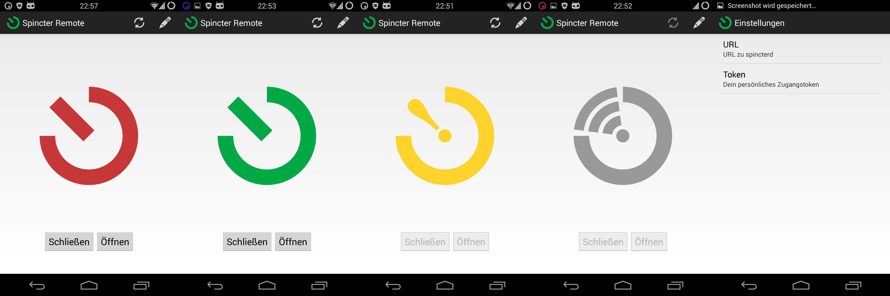

Trigger
=======

Trigger is an Android App to unlock doors or trigger other events via simple HTTPS calls.
Hardware schematics for a door mechanism and server software that work with this app can be found [here](https://github.com/openlab-aux/sphincter).

[](https://f-droid.org/packages/com.example.trigger/)



## Download

See [here](https://github.com/mwarning/trigger/releases) for APKs.

## Build from Sources

On Linux based systems:

```
./gradlew assembleRelease
```

## Development

Any help, bugfixes, new features are much welcome.

Feature suggestions:
- translations (only english and german available so far)
- more flexible trigger queries and protocols (ssh?)
- multiple trigger profiles
- use specific certificates

Feel free to fork this project, move it into an organisation or whatever the license allows. :-)

## API

Trigger allows you to set an URL (e.g. `https://example.com/door/`) and a token (e.g. `secret123`). When the open or close button is pressed, a HTTP request will be send. To open a door this might be the following:

```
https://example.com/door/?action=open&token=secret123
```

Trigger uses `open`, `close` or `state` as an action.
As a reponse, `LOCKED` or `UNLOCKED` may be returned.

An option allows to ignore certificate errors. But beware, that's dangerous!
