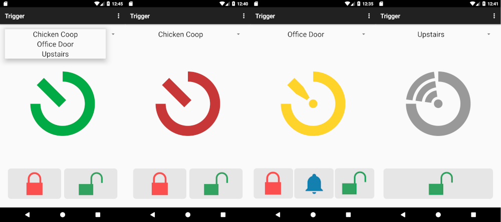
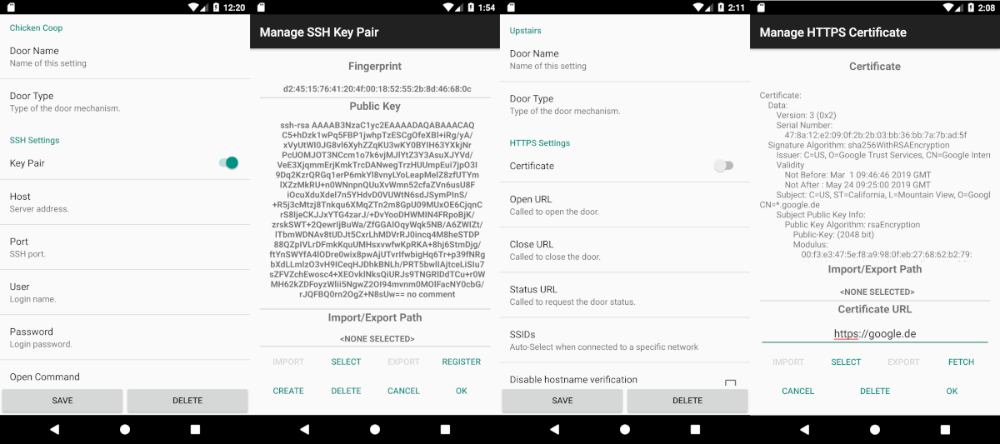

Trigger
=======

Trigger is an Android App to unlock/lock doors, show the door status and ring a bell.

Features:
 - HTTPS, SSH, Bluetooth and MQTT support
 - multiple door profiles
 - auto select profiles by SSID
 - certificate/key file support
 - QR code import/export
 - JSON file import/export
 - custom status images

(door status open/closed/unknown/no-wifi)

(ssh setup and key pair management, https setup and certificate management)

Any help, bugfixes, new features, translations are much welcome.

## Download

The minimum supported Android version is 5.0.

## Documentation

For further feature explanations and How-Tos, see the [Documentation](docs/documentation.md) page.

## Similar/Related Projects

* [Sphincter-Remote](https://github.com/openlab-aux/Sphincter-Remote) / [Sphincter](https://github.com/openlab-aux/sphincter)
* [D00r-app](https://github.com/h42i/d00r-app) / [D00r-key-server](https://github.com/h42i/d00r-key-server)
* [labadoor](https://github.com/ToLABaki/labadoor) / [DoorLock](https://wiki.tolabaki.gr/w/DoorLock_v3)
* [Krautschlüssel](https://gitlab.com/fiveop/krautschluessel)
* [MetalabDoorWidget](https://github.com/zoff99/MetalabDoorWidget)
* [HACKS](https://github.com/ktt-ol/hacs)
* [Stratum0Widget](https://github.com/Valodim/Stratum0Widget)

## License

This work is licenced under the GNU General Public License version 2 or later (GPLv2).

Icons: [Googles Material Design](https://material.io/tools/icons/)
