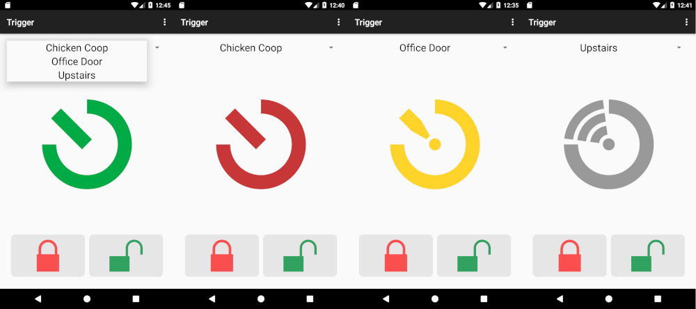
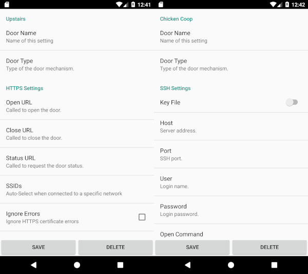

Trigger
=======

Trigger is an Android App to unlock/lock doors and request the status.

Features:
 - HTTPS, SSH and Bluetooth support
 - multiple door profiles
 - auto select profiles by connected device (WiFi/Bluetooth)
 - certificate/key file support



(door status open/closed/unknown/disabled)



(ssh setup and key pair management, https setup and certificate management)

Any help, bugfixes, new features, translations are much welcome.

## Download

[](https://f-droid.org/packages/com.example.trigger/)
[](https://github.com/mwarning/trigger/releases)

The minimum supported Android version is 5.0.

## Usage

The status of the door is determined if the https query or ssh command returns the strings `LOCKED` (door closed), `UNLOCKED` (door open) or some other output (unknown door state). The return message is displayed in the App for a short period.

## Build from Sources

On Linux based systems:

```
./gradlew assembleRelease
```

## Related Projects

* [Sphincter-Remote](https://github.com/openlab-aux/Sphincter-Remote)
* [D00r](https://github.com/h42i/d00r-app)
* [labadoor](https://github.com/ToLABaki/labadoor)
* [Krautschlüssel](https://gitlab.com/fiveop/krautschluessel)
* [MetalabDoorWidget](https://github.com/zoff99/MetalabDoorWidget)

## License

This work is licenced under the GNU General Public License version 2 or later (GPLv2).

Icons: [Googles Material Design](https://material.io/tools/icons/)
